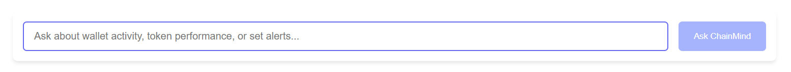

# ChainMind - AI-Powered Blockchain Assistant 🤖🔗

ChainMind transforms blockchain analysis using natural language. Query wallets, track tokens, and set alerts across Ethereum, Aptos, and XRPL with simple English commands.

[](https://chain-mind.vercel.app)



## Key Features ✨
- 🗣️ **Natural Language Processing** - Ask blockchain questions in plain English
- 📊 **Smart Dashboards** - Auto-generated visualizations for portfolio performance
- 🚨 **Real-time Alerts** - Get notified of whale movements and large transactions
- 🔄 **Multi-Chain Support** - Ethereum, Aptos, and XRPL in one interface
- 🤖 **AI Analyst** - Context-aware insights powered by LangChain and MCP
- 📱 **Webhook Integration** - Connect to Telegram, Discord, or email alerts

## Tech Stack ⚙️
| Component            | Technology                          |
|----------------------|-------------------------------------|
| **AI Engine**        | LangChain, OpenAI GPT-3.5/4        |
| **Blockchain Data**  | Nodit API, CoinGecko               |
| **Backend**          | Node.js, Express, SQLite           |
| **Frontend**         | Next.js, React, Chart.js           |
| **Alerts**           | SendGrid, Twilio (SMS)             |
| **Infrastructure**   | Docker, Vercel                     |

## Setup Guide 🛠️

### 1. Clone Repository
```bash
git clone https://github.com/GauravKarakoti/chainmind.git
cd chainmind
```
2. Install Dependencies
```bash
# Install backend dependencies
cd backend
npm install

# Install frontend dependencies
cd ../frontend
npm install
```
3. Configure Nodit
```bash
cp .env.example .env
```
`Change the axios post endpoint to localhost:3000 for local testing`
4. Run
```bash
# Start backend services
cd ../backend
npm run dev

# In separate terminal
cd ../frontend
npm run dev
```
5. Initialize Database
```bash
cd backend
node utils/db-init.js
```

## Usage
1. Ask a Question
Type in the chat:
`"What’s the current balance of 0xd8dA6BF26964aF9D7eEd9e03E53415D37aA96045 on Ethereum?"`

2. Set an Alert
Try:
`"Notify me when any wallet receives over 1000 APT in the next 24 hours."`

3. Track Portfolio Performance
Type in the chat: 
`"Analyze 0xd8dA6BF26964aF9D7eEd9e03E53415D37aA96045 portfolio over last 90 days"`

4. Compare Token Performance
Try:
`"Compare UNI vs AAVE trading volume on Ethereum this month"`

## Code Highlights
- [/ai/langchain_handler.py](https://github.com/GauravKarakoti/ChainMind/blob/main/ai/langchain_handler.py) - Maps natural language to blockchain operations:
```python
def parse_query(query: str) -> dict:
    # Uses LLM to translate query -> API call
    return {
        "api": "getTokenTransfers",
        "params": {"address": "0x..."}
    }
```
- [/backend/routes/ethereum.js](https://github.com/GauravKarakoti/ChainMind/blob/main/backend/routes/ethereum.js) - Unified blockchain access:
```javascript
router.post('/nodit-api', async (req, res) => {
    const response = await axios.post(
      'https://web3.nodit.io/v1/ethereum/mainnet/token/getTokenTransfersByAccount',
      {
        accountAddress: accountAddress,
        fromDate: new Date(Date.now() - 30 * 24 * 60 * 60 * 1000).toISOString(),
        toDate: new Date().toISOString()
      },
      { headers: { 'X-API-KEY': process.env.NODIT_API_KEY } }
    );
});
```
- [/backend/webhook.js](https://github.com/GauravKarakoti/ChainMind/blob/main/backend/webhook.js) - Webhook handler:
```javascript
app.post('/webhook/erc20-alerts', (req, res) => {
  if (tx.valueUSD > 10000) {
    sendEmailAlert(tx);
  }
});
```

## Project Structure 📂
```
chainmind/
├── ai/                   # LangChain integration
├── backend/              # Express server
│   ├── routes/           # API endpoints
│   ├── utils/            # Helpers and middleware
├── frontend/             # Next.js application
│   ├── components/       # React components
│   ├── pages/            # Application routes
│   ├── lib/              # Client-side helpers
├── data/                 # Database
├── README.md             # README
└── .gitignore            # Git Ignore
```

## Demo Video
[](https://youtu.be/GU-4AaRbhx4?si=Zzgjrn7nfutOtsS3)

---

Built with ❤️ using Nodit's powerful blockchain APIs

[Explore Nodit Documentation](https://docs.nodit.io/)